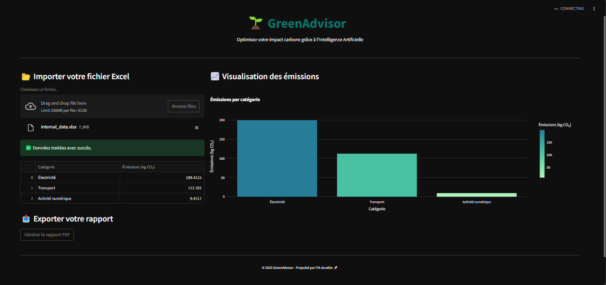

# 🌱 GreenAdvisor – Optimisez votre impact carbone avec l'IA

---

## 📌 Présentation

**GreenAdvisor** est une application intelligente permettant aux entreprises et particuliers de :

- 🧮 Analyser leurs émissions de CO₂ (électricité, transport, activité numérique)
- 🤖 Générer automatiquement des recommandations basées sur des modèles IA
- 📊 Visualiser les émissions via des graphiques interactifs
- 📄 Exporter un **rapport PDF personnalisé**

---

## 📸 Capture d’écran

---

## 🚀 Fonctionnalités principales

- Upload de fichiers Excel avec 3 feuilles : `electricity`, `transport`, `activity_log`
- Calcul automatique des émissions carbone (kg CO₂)
- Recommandations personnalisées via IA
- Graphique dynamique avec Plotly
- Export PDF prêt à partager

---

## 🧠 IA & Data Science

- Modélisation personnalisée des émissions
- Recommandations automatisées
- Structuration modulaire (FastAPI backend, utils, PDF, etc.)
- Visualisation interactive avec Plotly Express

---